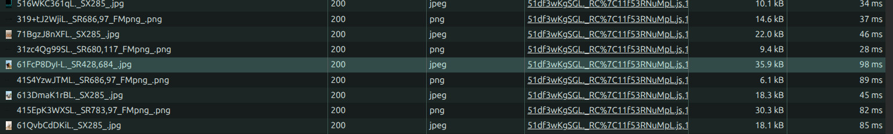
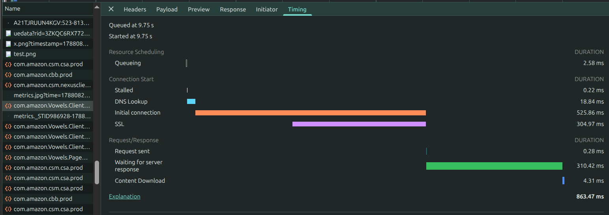
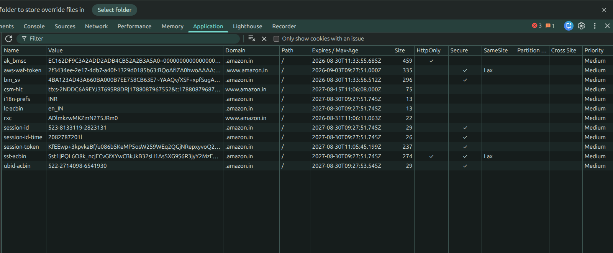

## 1. The Largest Image size

### Screenshot




## 2. Request Taking More Than 500ms

**Request:** POST

**Total Time:** 863.47 ms

### Why did it take more than 500ms?

The request took 863.47 ms, which is greater than 500 ms.

The main contributors were:

- Initial connection: 525.86 ms
- SSL: 304.97 ms
- Waiting for server response: 310.42 ms

The most of the time is taken to establish Initial Connection i.e 525.86 ms.

### Screenshot




## 3. Find a cookie set by the site and its expiry.

**Cookie Name:** `session-id`

**Domain:** `.amazon.in`

**Path:** `/`

**Expiry:** `2027-08-30T09:27:51.745Z`

The website sets a cookie named `session-id` for the `.amazon.in` domain.

The cookie has an explicit expiry time of **30 August 2027 at 09:27:51 UTC**, so it is a persistent cookie rather than a session-only cookie.

The cookie is also marked as **Secure**, meaning it is intended to be sent over secure HTTPS connections.

### Screenshot




## 4. JavaScript File

**JavaScript File:** `215h87168bl_.js`

**Loading behavior:** `async`

The JavaScript file named `215h87168bl_.js` in the HTML page has the `async` attribute

The async attribute allows the browser to download the JavaScript file while continuing to parse the HTML. Once the script has finished downloading, it can execute immediately, which may temporarily interrupt HTML parsing.

```html
<script async src="https://images-na.ssl-images-amazon.com/images/I/215h87168bl_.js"></script>